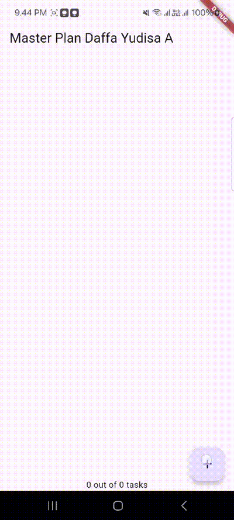

# Pertemuan 10 | Dasar State Management

A new Flutter project.

---

Nama : Daffa Yudisa Akbar

Kelas : TI-3A

NIM : 2241720008

---

## Tugas Praktikum 1

1. Selesaikan langkah-langkah praktikum tersebut, lalu dokumentasikan berupa GIF hasil akhir praktikum beserta penjelasannya di file README.md! Jika Anda menemukan ada yang error atau tidak berjalan dengan baik, silakan diperbaiki.

    **Jawab:**

    * Sesuai Kode Program:

        

        Pada hasil pertama ini terdapat error, dimana ketika list plan dari user yang ditambahkan sudah memenuhi layar (plan list + tampilan keyboard) maka keyboard tidak mau muncul karena posisi dari plan list terakhir akan bertabrakan yang menyebabkan keyboard tidak bisa tampil. Dengan begitu pengguna tidak bisa menambahkan plan lebih lanjut lebih dari 6 plan (jika dilihat dari gif di atas).

    * Setelah dimodifikasi:
    
        

        

        Setelah dilakukan modifikasi, maka masterplan tersebut bisa berjalan sesuai dengan yang diharapkan. Dimana user bisa menambahkan plan tanpa mengganggu fungsi keyboard, pada hasil ini dapat dilihat bahwa ketika tampilan layar sudah penuh (list dan keyboard) dan pengguna ingin mengisi atau mengubah plan pada posisi yang perlu discroll, maka ketika pengguna melakukan scroll keyboard akan hilang namun tetap bisa dipanggil kembali pada list yang akan dibuat atau diubah seperti gif di atas.
      

2. Jelaskan maksud dari langkah 4 pada praktikum tersebut! Mengapa dilakukan demikian?

    **Jawab:**

    

    Langkah 4 bertujuan untuk menyederhanakan dan merapikan proses impor dalam proyek ini dengan membuat file data_layer.dart yang berfungsi sebagai export file. File ini berada di dalam folder models dan hanya berisi perintah export untuk mengimpor file plan.dart dan task.dart.

    Maksud dari langkah ini adalah untuk menggabungkan beberapa file model (dalam hal ini, plan.dart dan task.dart) ke dalam satu titik akses. Dengan begitu, ketika kita perlu menggunakan model Plan dan Task di file lain dalam proyek, kita cukup mengimpor data_layer.dart daripada mengimpor plan.dart dan task.dart satu per satu.
  

3. Mengapa perlu variabel plan di langkah 6 pada praktikum tersebut? Mengapa dibuat konstanta ?

    **Jawab:**

    

    Variabel plan dalam kode PlanScreen digunakan untuk menyimpan data rencana atau tugas yang akan dikelola dan ditampilkan di layar aplikasi. Variabel ini dibuat sebagai konstanta agar data awalnya tetap stabil saat tampilan layar pertama kali dibuka. Dengan menjadikannya konstanta, aplikasi memastikan bahwa data awal tidak berubah secara tidak sengaja, sehingga lebih aman dan efisien. Nantinya, jika user menambahkan tugas baru, variabel ini bisa diperbarui sesuai kebutuhan melalui tombol tambah tugas.
  

4. Lakukan capture hasil dari Langkah 9 berupa GIF, kemudian jelaskan apa yang telah Anda buat!

    **Jawab:**

    
        
    Pada praktikum 1 yang dilakukan sampai dengan langkah 9 ini, saya telah membuat aplikasi sederhana yang menampilkan sebuah daftar (list) dan bisa mencentang list plan tertentu. Aplikasi ini memungkinkan pengguna untuk melihat berbagai item dalam list plan. Namun pada langkah ini belum ada tugas yang menangani mengenai tampilan keyboard, karena dapat dilihat pada gif yang di atas dapat dilihat bahwa keyboard akan selalu ditampilkan walaupun list ditambahkan dan pengguna melakuka scroll (kecuali user menutupnya secara manual), tidak seperti hasil praktikum yang ada di no. 1 tugas praktikum 1 sudah ada penanganan tertentu.
  

5. Apa kegunaan method pada Langkah 11 dan 13 dalam lifecyle state ?

    **Jawab:**

    * Langkah 11:

        

        Pada langkah 11, initState() digunakan untuk menginisialisasi pengaturan awal dari widget ketika pertama kali dibuat. Di sini, scrollController diatur untuk mendeteksi perubahan pada posisi scroll. Ketika user menggulir layar, listener yang ditambahkan akan secara otomatis menyembunyikan keyboard jika aktif, dengan memindahkan fokus ke objek baru (FocusNode). Ini menjaga tampilan tetap rapi saat user berinteraksi dengan daftar atau layar bergulir.

    * Langkah 13:

        

        Pada langkah 13, metode dispose() digunakan untuk membersihkan scrollController ketika widget tidak lagi digunakan atau dihapus dari layar. Ini penting agar aplikasi tidak membuang-buang sumber daya yang bisa digunakan di tempat lain, sehingga mencegah masalah seperti kebocoran memori dan menjaga aplikasi tetap berjalan dengan lancar.

  

## Tugas Praktikum 2

1. Selesaikan langkah-langkah praktikum tersebut, lalu dokumentasikan berupa GIF hasil akhir praktikum beserta penjelasannya di file README.md! Jika Anda menemukan ada yang error atau tidak berjalan dengan baik, silakan diperbaiki sesuai dengan tujuan aplikasi tersebut dibuat.

    **Jawab:**

    

    Pada praktikum 2 ini, yang dibuat masih sama dengan praktikum 1 yakni membuat aplikasi sederhana yang menampilkan sebuah daftar (list) dan bisa mencentang list plan tertentu. Pada bagian UI tidak ada yang berbeda namun ditambahkan tampilan pesan yang menunjukkan jumlah tasks yang telah diselesaikan dan jumlah total tasks dalam plan tersebut, misalnya, "3 out of 5 tasks". Selain itu pada praktikum ini menggunakan data dari PlanProvider (deklarasi variabel plan yang ada dihapus). Pada praktikum ini diterapkan cara memisahkan view dan model dengana baik.

      

2. Jelaskan mana yang dimaksud InheritedWidget pada langkah 1 tersebut! Mengapa yang digunakan InheritedNotifier?

    **Jawab:**

    

    Pada langkah 1, yang dimaksud dengan InheritedWidget adalah widget yang memungkinkan data diturunkan menuju widget child melalui tree widget. Data ini bisa diakses oleh child menggunakan konteks. Namun, dalam kode ini digunakan InheritedNotifier, yang merupakan turunan dari InheritedWidget dengan tambahan kemampuan untuk memberitahukan perubahan data secara otomatis kepada widget yang bergantung padanya.

    Alasan penggunaan InheritedNotifier adalah untuk mendapatkan pemberitahuan perubahan data pada objek Plan, yang dibungkus dalam ValueNotifier. Ketika data dalam ValueNotifier<Plan> berubah, InheritedNotifier secara otomatis memberi tahu widget yang bergantung padanya, memungkinkan tampilan aplikasi untuk tetap konsisten dan terupdate.

      

3. Jelaskan maksud dari method di langkah 3 pada praktikum tersebut! Mengapa dilakukan demikian?

    **Jawab:**

    

    Pada langkah 3, dua metode ditambahkan ke dalam model Plan untuk memberikan informasi terkait dengan tasks yang ada dalam plan. Metode pertama, completedCount, menghitung jumlah tasks yang sudah selesai dengan memfilter dan menghitung elemen-elemen dalam daftar tasks yang memiliki properti complete bernilai true. Metode kedua, completenessMessage, menghasilkan pesan yang menunjukkan jumlah tasks yang telah diselesaikan dan jumlah total tasks dalam plan tersebut, misalnya, "3 out of 5 tasks".

    Relasi antara kedua metode tersebut terletak pada bagaimana keduanya bekerja bersama untuk memberikan informasi yang lebih lengkap mengenai status tasks dalam plan. Metode completedCount menyediakan informasi berupa jumlah tasks yang telah selesai, sementara completenessMessage menggunakan informasi tersebut untuk menghasilkan pesan yang lebih deskriptif, seperti "3 out of 5 tasks." Dengan demikian, completenessMessage bergantung pada hasil dari completedCount untuk membangun pesan yang menunjukkan seberapa banyak tasks yang telah diselesaikan dibandingkan dengan jumlah total tasks.

      

4. Lakukan capture hasil dari Langkah 9 berupa GIF, kemudian jelaskan apa yang telah Anda buat!

    **Jawab:**

    

    Pada praktikum 2 ini, yang dibuat masih sama dengan praktikum 1 yakni membuat aplikasi sederhana yang menampilkan sebuah daftar (list) dan bisa mencentang list plan tertentu. Pada bagian UI tidak ada yang berbeda namun ditambahkan tampilan pesan yang menunjukkan jumlah tasks yang telah diselesaikan dan jumlah total tasks dalam plan tersebut, misalnya, "3 out of 5 tasks". Selain itu pada praktikum ini menggunakan data dari PlanProvider (deklarasi variabel plan yang ada dihapus). Pada praktikum ini diterapkan cara memisahkan view dan model dengana baik.

  

## Tugas Praktikum 3

1. Selesaikan langkah-langkah praktikum tersebut, lalu dokumentasikan berupa GIF hasil akhir praktikum beserta penjelasannya di file README.md! Jika Anda menemukan ada yang error atau tidak berjalan dengan baik, silakan diperbaiki sesuai dengan tujuan aplikasi tersebut dibuat.

    **Jawab:**

    

    GIF di atas merupakan hasil dari praktikum 3 yang telah dimodifikasi, dapat dilihat bahwa user bisa membuat beberapa plan yang nantinya bisa diisi dengan banyak tasks. Setiap plan memiliki halaman detailnya sendiri dimana user dapat menambahkan tasks baru menggunakan tombol floating action button (+). Pada setiap task, user dapat mengisi deskripsi tugas dan menandai status penyelesaiannya menggunakan checkbox. Status penyelesaian plan secara keseluruhan ditampilkan di bagian bawah layar, yang akan terupdate secara otomatis ketika ada perubahan pada tasks. Fitur scroll juga ditambahkan untuk mengakomodasi daftar tasks yang panjang, dengan behavior khusus dimana keyboard akan otomatis tertutup saat user melakukan scrolling.

      

2. Berdasarkan Praktikum 3 yang telah Anda lakukan, jelaskan maksud dari gambar diagram berikut ini!

    

    **Jawab:**

    Diagram di atas mengilustrasikan struktur widget dari aplikasi Master Plan yang terdiri dari dua segmen utama yang terkoneksi melalui mekanisme Navigator Push. Pada bagian kiri (berwarna biru) merupakan representasi dari halaman pembuat plan yang dimulai dengan MaterialApp sebagai widget induk, dilanjutkan dengan PlanProvider yang berperan dalam pengelolaan state aplikasi. Di bawahnya terdapat PlanCreatorScreen yang berfungsi sebagai halaman utama untuk membuat plan baru, menggunakan Column sebagai layout vertikal yang memuat TextField untuk input nama plan dan Expanded dengan ListView di dalamnya untuk menampilkan daftar plan yang telah dibuat. 

    Sementara itu, pada bagian kanan (berwarna hijau) menunjukkan struktur halaman detail plan yang juga diawali dengan MaterialApp, dilanjutkan dengan PlanScreen sebagai halaman detail yang muncul ketika plan diklik. Halaman ini menggunakan Scaffold untuk menyediakan struktur dasar material design, dengan Column sebagai layout vertikal yang memuat Expanded berisi ListView untuk menampilkan daftar tasks, serta SafeArea dengan Text untuk menampilkan status penyelesaian plan.

    Kedua bagian ini terhubung melalui Navigator Push yang memungkinkan navigasi dari halaman pembuat plan ke halaman detail plan ketika pengguna memilih salah satu plan dari daftar.

      

3. Lakukan capture hasil dari Langkah 14 berupa GIF, kemudian jelaskan apa yang telah Anda buat!

    **Jawab:**

    

    GIF hasil implementasi praktikum Langkah 14 menunjukkan aplikasi Master Plan yang berhasil menampilkan daftar plan dan detail tasks, namun terdapat dua masalah. Pertama, checkbox pada setiap task tidak dapat dicentang ketika diklik, yang berarti status penyelesaian task tidak bisa diubah. Kedua, tombol floating action button (+) untuk menambahkan task baru tidak berfungsi sebagaimana mestinya, sehingga user tidak dapat menambahkan task baru ke dalam plan (tidak bisa menambah lebih dari 1 tasks pada plan tertentu). Masalah ini disebabkan oleh pengelolaan state yang tidak tepat, khususnya pada bagian pembaruan nilai ValueNotifier di PlanProvider. Untuk mengatasi masalah tersebut, diperlukan perbaikan pada implementasi fungsi pembaruan state di _buildTaskTile untuk checkbox dan _buildAddTaskButton. Hal ini sudah diperbaiki dan hasilnya bisa dilihat pada GIF no. 1 tugas praktikum 3 kali ini.

  

## Tugas Kelompok PBL

1. Tambahkan class model yang dibutuhkan sesuai aplikasi PBL kelompok Anda! Bagilah tugas dengan anggota kelompok Anda untuk merancang proses state yang akan dilakukan pada aplikasi kelompok Anda. Lalu terapkan state management pada project kelompok yang telah Anda pelajari melalui praktikum ini.

    **Jawab:**

    * Model : mood.dart

        

    * Model : user.dart

        

  

2. Anda boleh menggunakan plugin/library pihak ketiga seperti riverpod, BLoC, provider atau lainnya untuk mengelola state pada project kelompok PBL.

    **Jawab:**

    * Menambahkan bloc pada project PBL

        

        

    * Bloc:

        

    * profile_bloc.dart

        profile_bloc.dart berfungsi untuk mengelola logika bisnis yang terkait dengan data profil pengguna pada halaman profil di aplikasi PBL. 

        

    * profile_event.dart

        profile_event.dart berfungsi untuk mendefinisikan berbagai event yang akan diproses oleh ProfileBloc di halaman profil. 

        

    * profile_state.dart
    
        profile_state.dart berfungsi untuk mendefinisikan state dalam pola BLoC (Business Logic Component) untuk halaman profil pengguna. Dalam BLoC, state mewakili kondisi atau status aplikasi pada suatu waktu tertentu, dan file ini menjelaskan berbagai kemungkinan state yang dapat terjadi terkait data profil pengguna.

        

    * Penerapan pada halaman profile

        

    * Hasil :

        
