# Pertemuan 11 | Pemrograman Asynchronous

A new Flutter project.

---

Nama : Daffa Yudisa Akbar

Kelas : TI-3A

NIM : 2241720008

---

## Soal 1

Tambahkan nama panggilan Anda pada title app sebagai identitas hasil pekerjaan Anda.
    
**Jawab:**

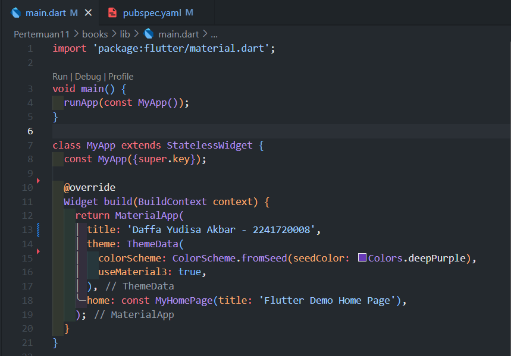

<br></br>

## Soal 2

Carilah judul buku favorit Anda di Google Books, lalu ganti ID buku pada variabel path di kode tersebut. Kemudian cobalah akses di browser URI tersebut dengan lengkap seperti ini. Jika menampilkan data JSON, maka Anda telah berhasil. Lakukan capture milik Anda dan tulis di README pada laporan praktikum. Lalu lakukan commit dengan pesan "W11: Soal 2".

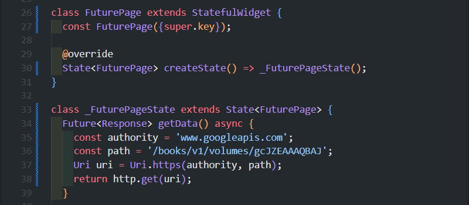

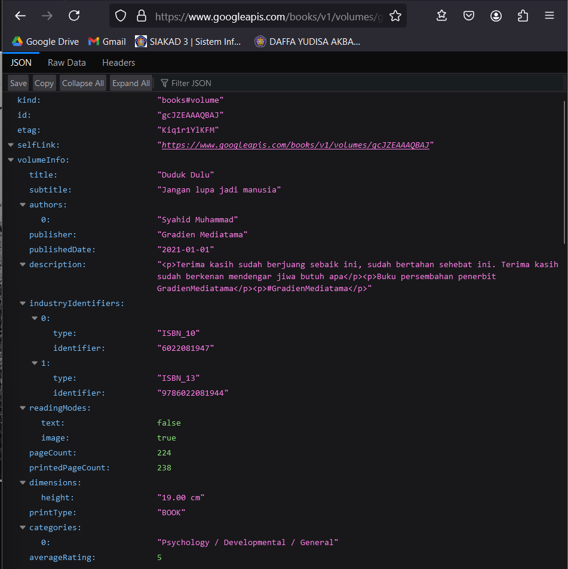

<br></br>

## Soal 3

* Jelaskan maksud kode langkah 5 tersebut terkait substring dan catchError!

    ```dart
    onPressed: () {
        setState(() {});
        getData().then((value) {
          result = value.body.toString().substring(0, 450);
          setState(() {});
        }).catchError((_) {
          result = 'An Error Occured';
          setState(() {});
        });
    },
    ```

    **Jawab:**

    - Fungsi substring(0, 450) digunakan untuk membatasi panjang data yang ditampilkan dalam variabel result, hanya menampilkan 450 karakter pertama dari respons API (value.body).

    - Fungsi catchError digunakan untuk menangkap kesalahan yang mungkin terjadi selama proses pengambilan data melalui metode getData(). Jika terjadi error (seperti kegagalan jaringan), variabel result akan diatur ke string 'An Error Occurred' sebagai pesan kesalahan.


* Capture hasil praktikum Anda berupa GIF dan lampirkan di README. Lalu lakukan commit dengan pesan "W11: Soal 3".

    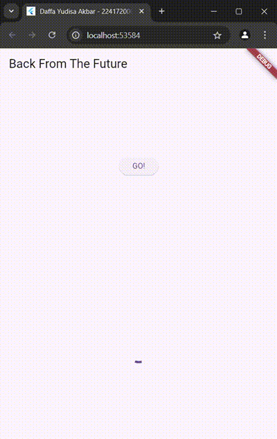

    <br></br>

## Soal 4

* Jelaskan maksud kode langkah 1 dan 2 tersebut!

    ```dart
    Langkah1
    Future<int> returnOneAsync() async {
        await Future.delayed(const Duration(seconds: 3));
        return 1;
    }

    Future<int> returnTwoAsync() async {
        await Future.delayed(const Duration(seconds: 3));
        return 2;
    }

    Future<int> returnThreeAsync() async {
        await Future.delayed(const Duration(seconds: 3));
        return 3;
    }

    Langkah2
    Future count() async {
        int total = 0;
        total = await returnOneAsync();
        total += await returnTwoAsync();
        total += await returnThreeAsync();
        setState(() {
        result = total.toString();
        });
    }
    ```

    **Jawab:**

    * Pada Langkah 1, terdapat tiga fungsi asinkron, yaitu returnOneAsync(), returnTwoAsync(), dan returnThreeAsync(). Setiap fungsi ini menggunakan Future.delayed untuk menunda eksekusi selama 3 detik setiap fungsinya sebelum mengembalikan nilai integer masing-masing: 1, 2, dan 3.

    * Pada Langkah 2, fungsi count() digunakan untuk menghitung total dari nilai yang dikembalikan oleh ketiga fungsi asinkron tersebut. Eksekusi dilakukan secara berurutan menggunakan kata kunci await, sehingga total pertama kali diberi nilai dari returnOneAsync(), lalu ditambah nilai dari returnTwoAsync(), dan terakhir returnThreeAsync(). Setelah total selesai dihitung, nilai ini diubah menjadi string dan disimpan ke dalam variabel result melalui pemanggilan setState()

    * Sebelum menampilkan output berupa penjumlahan tiap fungsi asinkron melalui langkah 2, akan ada delayed 9 detik sebelum menampilkan output tersebut pada emulator. hal ini karena adanya Future.delayed untuk menunda eksekusi selama 3 detik dari setiap fungsi pada langkah 1

* Capture hasil praktikum Anda berupa GIF dan lampirkan di README. Lalu lakukan commit dengan pesan "W11: Soal 4".

    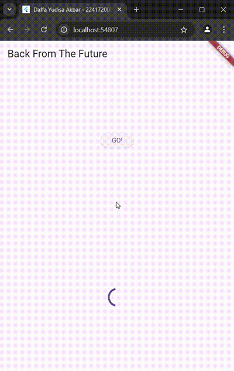

    <br></br>

## Soal 5

* Jelaskan maksud kode langkah 2 tersebut!

    ```dart
    late Completer completer;

    Future getNumber() {
        completer = Completer<int>();
        calculate();
        return completer.future;
    }

    Future calculate() async {
        await Future.delayed(const Duration(seconds : 5));
        completer.complete(42);
    }
    ```

    **Jawab:**

    Kode ini membuat fungsi getNumber() yang akan menjalankan fungsi async calculate() dan mengembalikan sebuah Future. Proses pada fungsi async calculate() dilakukan secara asinkron selama 5 detik (terjadi delay selama 5 detik). Lalu Future pada fungsi getNumber() tersebut mendapatkan nilai 42 menggunakan metode completer.complete(42) yang ada di async calculate().

* Capture hasil praktikum Anda berupa GIF dan lampirkan di README. Lalu lakukan commit dengan pesan "W11: Soal 5".

    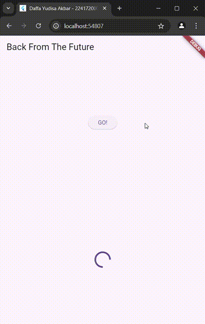

    <br></br>

## Soal 6

* Jelaskan maksud perbedaan kode langkah 2 dengan langkah 5-6 tersebut!

    ```dart
    Langkah5
    Future calculate() async {
        try {
            await Future.delayed(const Duration(seconds: 5));
            completer.complete(42);
        } catch (_) {
            completer.completeError({});
        }
    }

    Langkah6
    getNumber().then((value) {
        setState(() {
            result = value.toString();
        });
    }).catchError((e) {
        result = 'An error occurred';
    });
    ```

    **Jawab:**

    - Langkah 2 hanya menangani hasil sukses tanpa penanganan kesalahan.

    - Langkah 5-6 menambahkan penanganan kesalahan dengan try-catch dalam calculate() dan menangani hasil serta kesalahan di pemanggilan getNumber() yang ada pada elevatedbutton menggunakan then untuk hasil sukses dan catchError untuk menangani error dengan pesan "An error occurred".

* Capture hasil praktikum Anda berupa GIF dan lampirkan di README. Lalu lakukan commit dengan pesan "W11: Soal 6".

    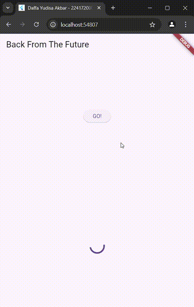

    <br></br>

## Soal 7

Capture hasil praktikum Anda berupa GIF dan lampirkan di README. Lalu lakukan commit dengan pesan "W11: Soal 7".

Dengan adanya Future Group delay dari output yang dimunculkan hanya 3 detik, tidak seperti saat menggunakan future biasa yang saling tunggu. Hal ini karena Future Group akan menjalannya secara bersamaan.

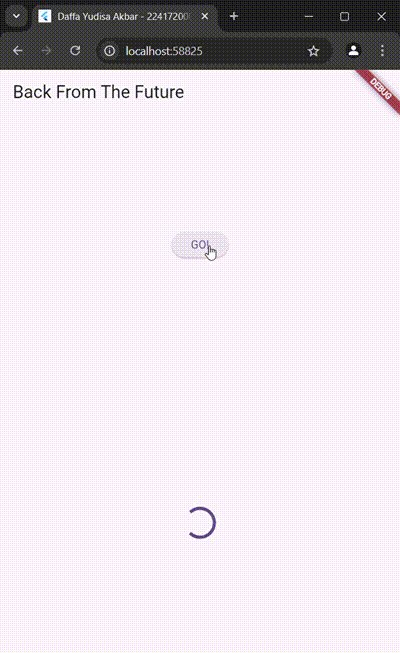

<br></br>

## Soal 8

Jelaskan maksud perbedaan kode langkah 1 dan 4!

```dart
Langkah1
void returnFG() {
    FutureGroup<int> futureGroup = FutureGroup<int>();
    futureGroup.add(returnOneAsync());
    futureGroup.add(returnTwoAsync());
    futureGroup.add(returnThreeAsync());
    futureGroup.close();
    futureGroup.future.then((List<int> value) {
      int total = 0;
      for (var element in value) {
        total += element;
      }
      setState(() {
        result = total.toString();
      });
    });
  }

Langkah4
final futures = Future.wait<int>([
  returnOneAsync(),
  returnTwoAsync(),
  returnThreeAsync(),
]);
```

**Jawab:**

* Langkah 1 menggunakan FutureGroup untuk menambahkan Future satu per satu, menutup grup, dan kemudian menangani hasilnya setelah semua Future selesai. Ini lebih manual dan memerlukan lebih banyak langkah.

* Langkah 4 menggunakan Future.wait(), yang lebih sederhana dan langsung, untuk menunggu beberapa Future bersamaan dan mendapatkan hasilnya dalam satu langkah.

* Penggunaan FutureGroup nampak lebih banyak dan tidak sederhana tetapi akan memberikan kontrol lebih yang membantu kita untuk mengatur fungsi yang ada lebih mendetail misal untuk suatu kasus yang lebih kompleks. Dan jika tidak membutuhkan pengaturan lebih lanjut penggunaan Future.wait() yang disimpan pada suatu variabel akan memberikan hasil yang lebih optimal

<br></br>

## Soal 9

Capture hasil praktikum Anda berupa GIF dan lampirkan di README. Lalu lakukan commit dengan pesan "W11: Soal 9".

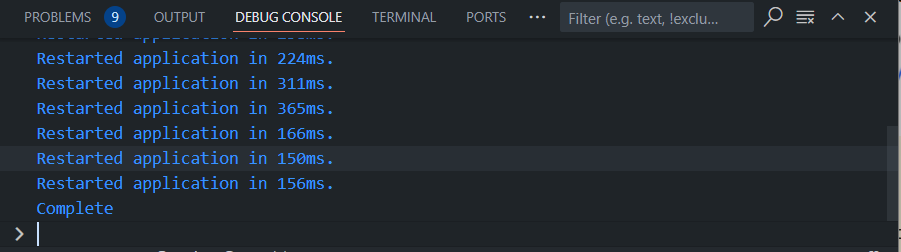

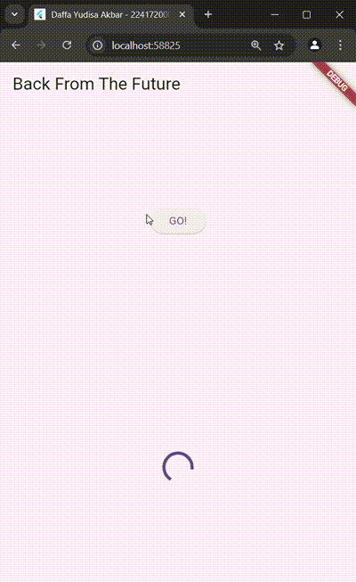

<br></br>

## Soal 10

Panggil method handleError() tersebut di ElevatedButton, lalu run. Apa hasilnya? Jelaskan perbedaan kode langkah 1 dan 4!

```dart
Langkah1
Future returnError() async {
    await Future.delayed(const Duration(seconds: 2));
    throw Exception('Something Terrible Happened!');
}

Langkah4
Future handleError() async {
    try {
      await returnError();
    } catch (error) {
      setState(() {
        result = error.toString();
      });
    } finally {
      print('Complete');
    }
}
```

**Jawab:**

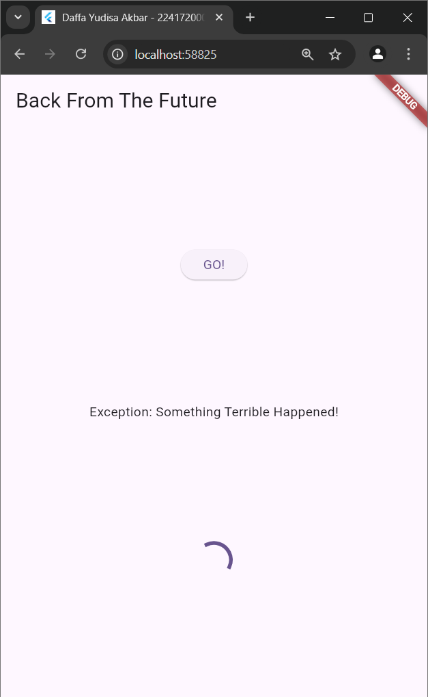

Perbedaan utama antara kode pada Langkah 1 dan Langkah 4 terletak pada bagaimana error ditangani. Pada Langkah 1, fungsi returnError() hanya melemparkan sebuah exception tanpa menangani atau mengelola error tersebut. Fungsi ini tidak memiliki mekanisme untuk menangkap atau memanipulasi exception.

Pada Langkah 4, fungsi handleError() memanggil returnError() di dalam blok try, yang memungkinkan pengecekan error. Jika returnError() melemparkan exception, blok catch di dalam handleError() akan menangkapnya dan melakukan penanganan dengan memperbarui tampilan UI menggunakan setState() untuk menampilkan pesan error tersebut. Selain itu, blok finally akan tetap dieksekusi setelah blok try atau catch selesai, yang mencetak 'Complete' ke konsol.

<br></br>

## Soal 11

Tambahkan nama panggilan Anda pada tiap properti title sebagai identitas pekerjaan Anda.

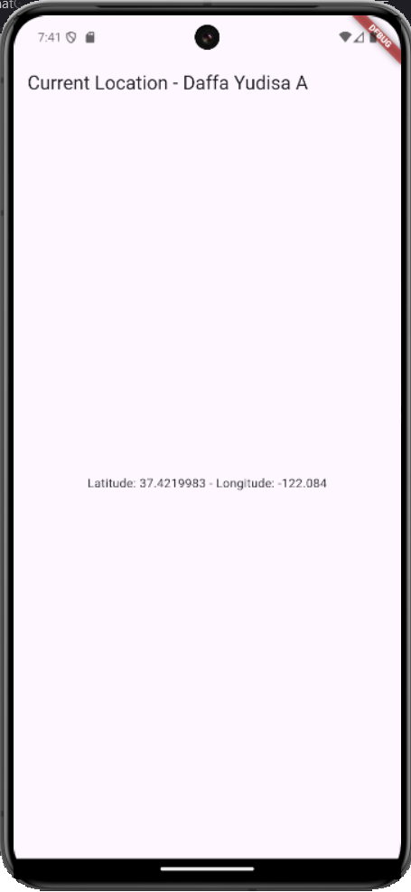


<br></br>

## Soal 12

* Jika Anda tidak melihat animasi loading tampil, kemungkinan itu berjalan sangat cepat. Tambahkan delay pada method getPosition() dengan kode await Future.delayed(const Duration(seconds: 3));

    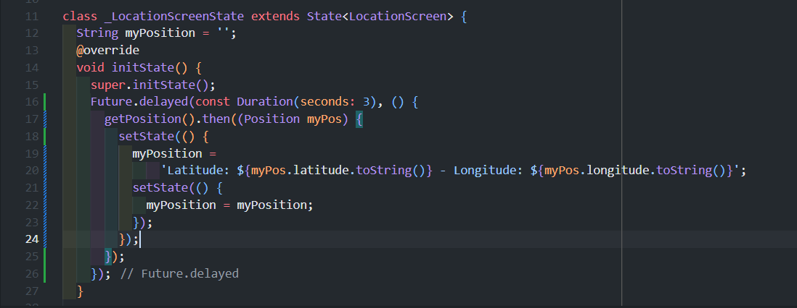

* Apakah Anda mendapatkan koordinat GPS ketika run di browser? Mengapa demikian?

    **Jawab:**

    Ketika dirun pada browser koordinat GPS tidak bisa didapatkan. Karena pada praktikum kali ini tidak ditambahkannya izin akses lokasi pada bagian web, tidak seperti emulator android yang telah diatur pada langkah 2 Praktikum 6 ini yang menambahkan izin GPS melalui androidmanifest.xml

* Capture hasil praktikum Anda berupa GIF dan lampirkan di README. Lalu lakukan commit dengan pesan "W11: Soal 12".

    

    <br></br>

## Soal 13

* Apakah ada perbedaan UI dengan praktikum sebelumnya? Mengapa demikian?

    **Jawab:**

    Untuk tampilan UI saat emulator dijalankan tidak ada perubahan, hal tersebut dikarenakan pada praktikum ini kita hanya mengubah proses buildingnya saja.

* Capture hasil praktikum Anda berupa GIF dan lampirkan di README. Lalu lakukan commit dengan pesan "W11: Soal 13".

    

* Seperti yang Anda lihat, menggunakan FutureBuilder lebih efisien, clean, dan reactive dengan Future bersama UI.

    <br></br>

## Soal 14

* Apakah ada perbedaan UI dengan langkah sebelumnya? Mengapa demikian?

    **Jawab:**

    Jika dilihat maka tidak ada tampilan UI yang berubah kecuali jika terjadi error maka akan memunculkan teks berupa 'Something terrible happened!'

* Capture hasil praktikum Anda berupa GIF dan lampirkan di README. Lalu lakukan commit dengan pesan "W11: Soal 14".

    - Ketika GPS Diaktifkan:

        

    - Ketika GPS Tidak Diaktifkan (Error):

        

    <br></br>

## Soal 15

* Tambahkan nama panggilan Anda pada tiap properti title sebagai identitas pekerjaan Anda.

* Silakan ganti dengan warna tema favorit Anda.

    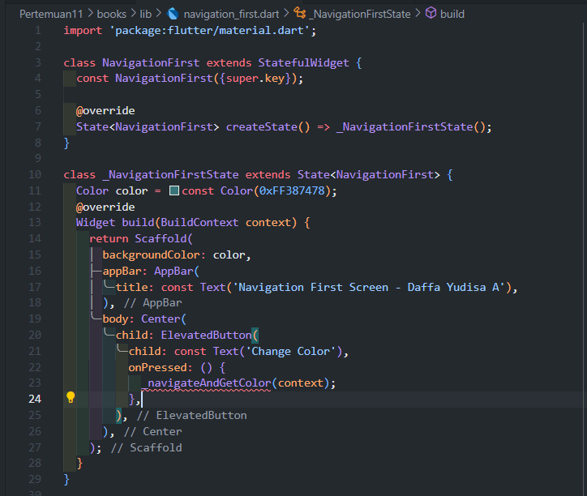

    <br></br>

## Soal 16

* Cobalah klik setiap button, apa yang terjadi ? Mengapa demikian ?

    **Jawab:**

    - Layar pertama bernama NavigationFirst, berfungsi sebagai titik awal aplikasi. Pada layar ini, terdapat sebuah tombol bertuliskan "Change Color" yang memungkinkan pengguna untuk berpindah ke layar kedua, yaitu NavigationSecond. 
    
    - NavigationSecond, menyediakan tiga tombol dengan label Red, Brown, dan Amber. Setiap tombol merepresentasikan warna tertentu yang akan dikembalikan ke layar pertama menggunakan fungsi Navigator.pop, yang juga membawa data warna yang dipilih oleh pengguna. Misalnya, jika tombol Red ditekan, warna merah dikirim kembali ke layar pertama.

    - Pada layar pertama, data warna ini diterima oleh fungsi _navigateAndGetColor dan disimpan dalam variabel color. Setelah itu, setState dipanggil untuk memperbarui UI, mengubah latar belakang layar menjadi warna yang baru dipilih. 

* Gantilah 3 warna pada langkah 5 dengan warna favorit Anda!

    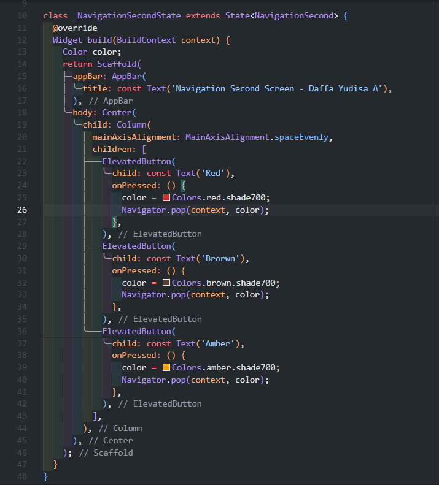

* Capture hasil praktikum Anda berupa GIF dan lampirkan di README. Lalu lakukan commit dengan pesan "W11: Soal 16"

    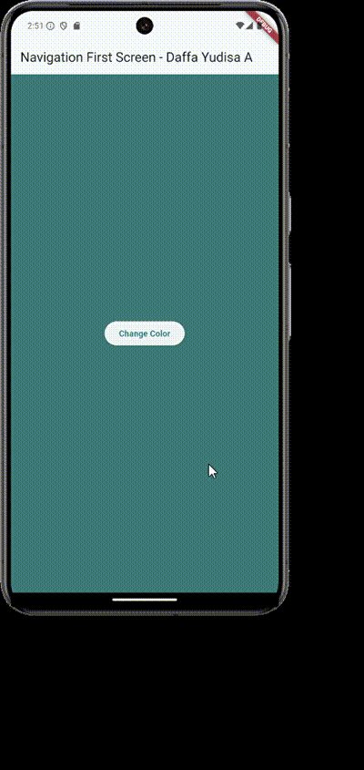

    <br></br>

## Soal 17

* Cobalah klik setiap button, apa yang terjadi ? Mengapa demikian ?

    **Jawab:**

    - Pada praktikum ini akan menampilkan layar dengan latar belakang berwarna biru secara default, dan ada sebuah tombol bertuliskan "Change Color". Ketika tombol ini ditekan, sebuah dialog akan muncul di tengah layar. Dialog tersebut berisi pesan "Please Choose a Color" dengan tiga tombol opsi warn yakni Grey, Orange, dan Teal.

    - Jika salah satu tombol warna ditekan, dialog akan tertutup, dan warna yang dipilih akan dikirim kembali ke layar utama melalui fungsi Navigator.pop. Warna yang diterima kemudian disimpan dalam variabel color di dalam fungsi _showColorDialog. Fungsi setState dipanggil setelah itu untuk memperbarui UI, mengganti warna ltar belakang layar utama dengan warna yang baru dipilih.

* Gantilah 3 warna pada langkah 3 dengan warna favorit Anda!

    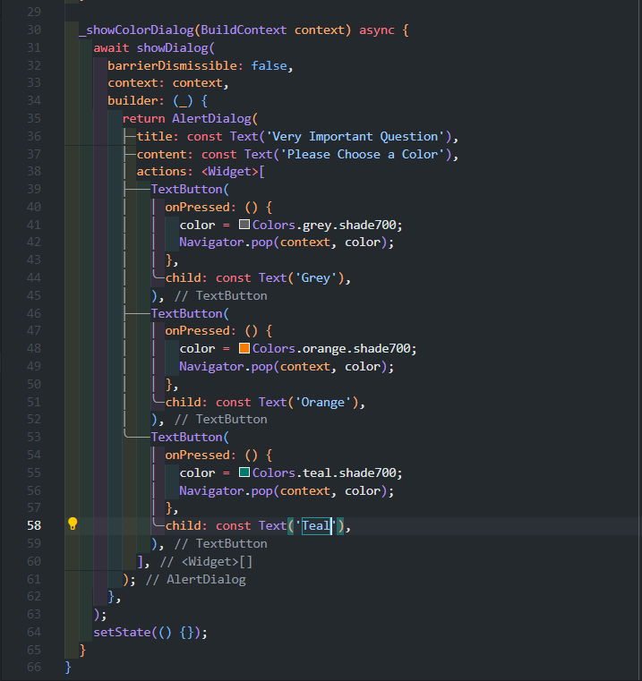

* Capture hasil praktikum Anda berupa GIF dan lampirkan di README. Lalu lakukan commit dengan pesan "W11: Soal 17".

    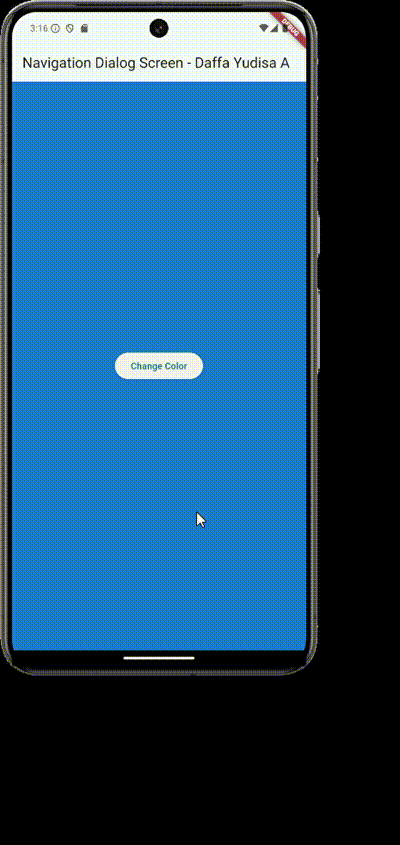

    <br></br>