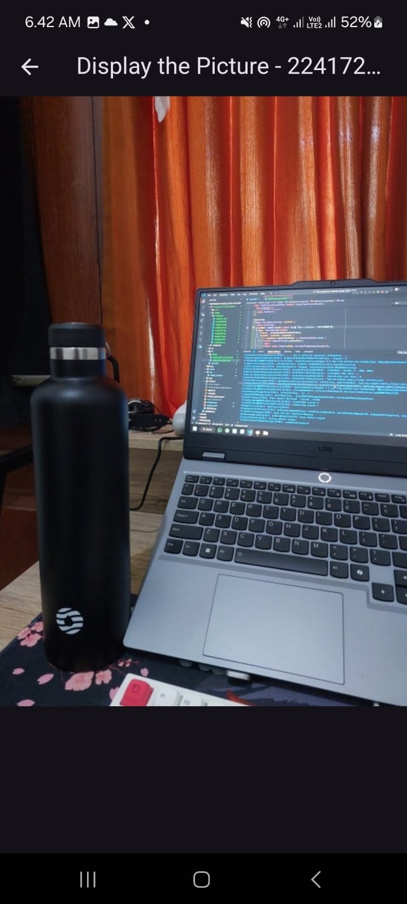

# Tugas Praktikum

**Nama : Daffa Yudisa Akbar**

**Kelas : TI-3A / 06**

**NIM : 2241720008**

---

1. Selesaikan Praktikum 1 dan 2, lalu dokumentasikan dan push ke repository Anda berupa screenshot setiap hasil pekerjaan beserta penjelasannya di file README.md! Jika terdapat error atau kode yang tidak dapat berjalan, silakan Anda perbaiki sesuai tujuan aplikasi dibuat!

    **Jawab:**

    * ## Praktikum 1
        - **Langkah 1 : Membuat project flutter baru dengan nama kamera_flutter**

            

        - **Langkah 2 : Tambah dependensi yang diperlukan**

            

            Pada langkah ini ditambahkan tiga dependensi yang akan digunakan pada project flutter praktikum kali ini menggunakan perintah flutter pub add camera path_provider path pada terminal. Adapun ketiga dependensi dan fungsinya adalah sebagai berikut: 
            
            * camera --> menyediakan seperangkat alat untuk bekerja dengan kamera pada device.

            * path_provider -->  menyediakan lokasi atau path untuk menyimpan hasil foto.

            * path --> membuat path untuk mendukung berbagai platform.

        - **Langkah 3 : Ambil Sensor Kamera dari device**

            

            * WidgetsFlutterBinding.ensureInitialized(); memastikan bahwa semua layanan yang diperlukan oleh plugin Flutter telah diinisialisasi, sehingga memungkinkan pemanggilan fungsi-fungsi yang bergantung pada layanan tersebut tanpa mengalami kesalahan.

            * Aplikasi memanggil fungsi asinkron availableCameras(), yang mengembalikan daftar kamera yang tersedia di perangkat. Dengan menggunakan kata kunci await, aplikasi menunggu hingga fungsi tersebut selesai dieksekusi dan hasilnya disimpan dalam variabel cameras

            * final firstCamera = cameras.first; mengambil kamera pertama dari daftar yang ada, sehingga variabel firstCamera berisi referensi ke kamera tersebut.

            Langkah ini memastikan bahwa akses kamera dapat dijalankan, dengan semua layanan yang diperlukan sudah siap sebelum menjalankan aplikasi.

        - **Langkah 4 : Buat dan inisialisasi CameraController**

            

            Kode program di atas mendefinisikan kelas TakePictureScreen, sebuah widget dalam aplikasi Flutter yang memungkinkan user mengambil gambar menggunakan kamera tertentu. Konstruktor TakePictureScreen menerima parameter camera, yaitu objek CameraDescription yang mewakili kamera yang akan digunakan. Dalam metode initState(), instance CameraController dibuat untuk mengelola interaksi dengan kamera, diinisialisasi dengan kamera yang dipilih dan resolusi ResolutionPreset.medium. Proses ini menghasilkan Future yang disimpan dalam variabel _initializeControllerFuture.

            Saat widget dihapus, metode dispose() dipanggil untuk membersihkan sumber daya dengan memanggil _controller.dispose(), mencegah kebocoran memori. serta terdapat metode build() yang pada langkah ini hanya mengembalikan Container, bagian ini akan digunakan untuk membangun UI.

        - **Langkah 5 : Gunakan CameraPreview untuk menampilkan preview foto**

            

            Kode program di atas adalah bagian dari TakePictureScreen dalam aplikasi. Di sini, digunakan sebuah struktur bernama Scaffold yang menyediakan dasar untuk tampilan layar, termasuk bagian atas (AppBar) yang menampilkan judul "Take a picture - NIM Anda". Di bagian tengah layar, kita menggunakan FutureBuilder untuk mengatur tampilan saat kamera sedang diinisialisasi.

            Jika kamera sudah siap, user akan melihat preview dari kamera. Namun, jika kamera masih dalam proses persiapan, user akan melihat CircularProgressIndicator di tengah layar. Dengan cara ini memastikan bahwa user hanya melihat tampilan kamera setelah semuanya siap,

        - **Langkah 6 : Ambil foto dengan CameraController**

            

            Kode program pada langkah ini membuat tombol untuk mengambil gambar dalam aplikasi. Tombol ini berupa FloatingActionButton, dan ketika ditekan, akan menjalankan fungsi untuk mengambil foto.

            Di dalam fungsi tersebut, kode pertama-tama memastikan bahwa kamera sudah siap digunakan. Kemudian, mencoba untuk mengambil gambar. Jika pengambilan gambar berhasil, lokasi penyimpanan foto akan diketahui. Namun, jika terjadi kesalahan saat mencoba mengambil gambar, pesan kesalahan akan dicetak ke konsol.

        - **Langkah 7 : Buat widget baru DisplayPictureScreen**

            

            Kode program pada langkah ini adalah untuk layar yang menampilkan gambar yang diambil oleh user. Kelas ini bernama DisplayPictureScreen, ketika dibuat kelas ini menerima satu parameter, yaitu imagePath, yang merupakan lokasi file gambar.

            Layar ini menggunakan Scaffold untuk menyusun tampilan, termasuk bagian atas yang menampilkan judul "Display the Picture - NIM Anda". Di bagian body layar, gambar ditampilkan sesuai dengan path.

        - **Langkah 8 : Edit main.dart**

            

            Kode program pada langkah ini adalah bagian dari fungsi runApp yang memulai aplikasi Flutter. Di sini, MaterialApp digunakan untuk memberikan tampilan dan tema aplikasi. Layar awal aplikasi adalah TakePictureScreen, yang memungkinkan user untuk mengambil gambar. Kamera yang digunakan ditentukan oleh parameter camera, yang mengirimkan kamera pertama yang telah dipilih.

        - **Langkah 9 : Menampilkan hasil foto**

            

            Kode program pada langkah ini merupakan penambahan pada bagian yang menangani pengambilan gambar di layar TakePictureScreen. Setelah mengambil gambar dengan kamera, kode ini memeriksa apakah konteks aplikasi masih aktif. Jika aktif, kode akan berpindah ke layar baru yang menampilkan gambar yang baru diambil.

            Layar baru tersebut adalah DisplayPictureScreen, yang menerima path dari gambar yang disimpan sebagai parameter. Dengan penambahan ini, user dapat segera melihat foto yang mereka ambil, meningkatkan pengalaman menggunakan aplikasi.

        - **Hasil :**

            Merupakan hasil ketika foto/gambar belum diambil (tombol floating action button belum diklik):

            

            Merupakan hasil ketika foto/gambar sudah diambil (menuju DisplayPictureScreen)

            

    
      

    * ## Praktikum 2

        - **Langkah 1 : Buat project baru**

            

        - **Langkah 2 : Buat widget Selector ring dan dark gradient**

            

            Pada langkah ini dibuat sebuah widget bernama FilterSelector, yang memungkinkan user memilih warna filter. Widget ini menggunakan halaman yang bisa diswipe, di mana setiap halaman mewakili satu warna dari daftar yang diberikan. Ketika user mengganti halaman, warna filter yang baru dipilih akan diperbarui dan diberitahukan kepada fungsi yang ditentukan.

            Widget ini juga dilengkapi dengan tampilan menarik, termasuk bayangan gradien, tampilan karusel warna filter, dan ring di sekitar warna/filter yang sedang dipilih. Dengan FilterSelector, user dapat dengan mudah memilih warna filter yang diinginkan dalam aplikasi.

        - **Langkah 3 : Buat widget photo filter carousel**

            

            Pada langkah ini dibuat widget bernama PhotoFilterCarousel, yang memungkinkan user untuk menerapkan berbagai filter warna pada gambar. Widget ini memiliki daftar warna filter yang mencakup warna putih dan beberapa warna lainnya. Ketika user memilih filter, warna tersebut diterapkan pada gambar yang ditampilkan.

            Gambar diambil dari URL tertentu dan akan tampil dengan efek warna filter yang dipilih. Dengan demikian, user dapat dengan mudah melihat bagaimana gambar mereka terlihat dengan berbagai filter. Widget ini juga menyertakan FilterSelector, yang membantu user dalam memilih filter yang diinginkan dari daftar warna yang ada.

        - **Langkah 4 : Membuat filter warna - bagian 1**

            

            Pada langkah ini dibuat kelas CarouselFlowDelegate untuk mengatur tampilan item dalam carousel. Fungsinya adalah mengontrol bagaimana item ditampilkan saat user menswipe.

            Metode paintChildren menghitung item yang terlihat dan mengatur ukuran serta transparansinya. Item yang lebih dekat ke pusat tampilan akan terlihat lebih besar dan lebih jelas, sementara yang jauh akan lebih kecil dan lebih transparan. Ini menciptakan efek visual yang menarik saat user menswipe. Metode shouldRepaint memastikan tampilan diperbarui hanya saat posisi scroll berubah.
        
        - **Langkah 5 : Membuat filter warna**

            

             Pada langkah ini didefinisikan kelas FilterItem, yang merupakan widget untuk menampilkan item filter warna dalam bentuk bulat.

            Widget ini menggunakan GestureDetector agar user bisa mengkliknya. Ketika item diklik, fungsi onFilterSelected akan dipanggil, jika disediakan. Dalam tampilan, gambar diambil dari URL dan diterapkan efek warna sesuai dengan properti color yang diberikan, dengan transparansi yang diatur menggunakan withOpacity(0.5)

        - **Langkah 6 : Implementasi filter carousel**

            

            Di langkah ini, kita mengatur aplikasi utama dengan mengimpor widget PhotoFilterCarousel. Kode yang dituliskan akan menjalankan aplikasi Flutter, dengan PhotoFilterCarousel sebagai tampilan utamanya. 

        - **Hasil :**

            Sebelum Memilih Filter:

            

            Setelah Memilih Filter:

            

            

            

        ---

  

2. Gabungkan hasil praktikum 1 dengan hasil praktikum 2 sehingga setelah melakukan pengambilan foto, dapat dibuat filter carouselnya!

    **Jawab:**

    Pada penggabungan ini, basis dari programnya saya menggunakan pada praktikum 2 dengan project photo_filter_carousel. Namun pada praktikum 2 tersebut, belum ada kamera untuk mengambil gambar maka dilakukan modifikasi atau penyesuaian sebagai berikut:

    - **Langkah 1: Pada langkah ini saya menambahkan dependensi camera, path, dan path_provider**

        

    - **Langkah 2: Pada langkah ini menambahkan class TakePictureScreen dari praktikum 1**

        

        

        Kode program ini akan membuat halaman yang memungkinkan user untuk mengambil foto menggunakan kamera dan kemudian menerapkan filter pada foto tersebut. Program ini menggunakan CameraController dari paket camera untuk mengakses kamera perangkat. Pada saat halaman TakePictureScreen dibuka, aplikasi akan menginisialisasi kamera dengan resolusi sedang (ResolutionPreset.medium). Setelah kamera siap, tampilan kamera akan muncul pada layar sebagai pratinjau.

        Saat user menekan tombol kamera (ikon FloatingActionButton), aplikasi akan menangkap foto dan menyimpannya sementara. Kemudian, aplikasi akan menavigasi ke halaman PhotoFilterCarousel, tempat foto yang diambil akan ditampilkan dengan opsi untuk menerapkan filter. Path gambar yang diambil (image.path) diteruskan ke widget PhotoFilterCarousel agar user bisa melihat foto yang sudah diambil dengan berbagai filter.

    - **Langkah 3: Pada langkah ini menambahkan class TakePictureScreen dari praktikum 1**

        

        Pada kode yang telah dimodifikasi ini, kelas PhotoFilterCarousel telah diubah untuk mendukung penampilan gambar yang diambil oleh user melalui kamera. Dalam kode ini, PhotoFilterCarousel menerima sebuah parameter bernama imagePath, yang merupakan path lokal gambar hasil tangkapan kamera user. Gambar ini kemudian ditampilkan menggunakan widget Image.file. Berbeda dari kode pada praktikum 2, yang hanya menampilkan gambar dari URL dengan Image.network, kode terbaru juga menambahkan elemen Scaffold dan AppBar dalam metode _buildPhotoWithFilter() untuk memberikan  judul pada halaman filter ("Filter the Picture - 2241720008"). Selain itu, impor dart:io ditambahkan untuk mengambil gambar dari file lokal, yang merupakan bagian penting dalam penggunaan Image.file.

        Secara keseluruhan, modifikasi ini memungkinkan PhotoFilterCarousel untuk menampilkan gambar sesuai dengan foto yang diambil user serta menambahkan filter yang diinginkan.

    - **Hasil:**

        

    - **Kesimpulan:**
        
        Pada tugas ini dilakukan penggabungan dari hasil praktikum 1 dan praktikum 2, sehingga user bisa mengambil gambar dari perangkat mereka kemudian gambar tersebut bisa menerapkan filter yang telah disediakan. Pada praktikum ini basis kode program yang digunakan diambil dari praktikum 2 dengan sedikit penyesuaian, dan ditambahkan fungsi kamera dari praktikum 1 tetntunya dengan penyesuaian juga. Tugas nomor 2 ini saya buat project tersendiri yang bernama camera_filter_carousel sehingga tidak mengubah hasil dari praktikum 1 ataupun praktikum 2 yang telah dikerjakan.
    ---

  

3. Jelaskan maksud void async pada praktikum 1?

    **Jawab:**

    Dalam Dart, void adalah tipe pengembalian yang menunjukkan bahwa fungsi tidak mengembalikan nilai apa pun. Ketika digunakan dalam konteks fungsi async, seperti dalam praktikum 1, void menunjukkan bahwa fungsi tersebut tidak akan mengembalikan nilai ketika selesai dieksekusi, tetapi tetap dapat menjalankan operasi yang bersifat asinkron. Dengan menandai fungsi dengan keyword async, kita memberi tahu Dart bahwa fungsi tersebut mungkin akan melakukan operasi yang memakan waktu, seperti memanggil API atau mungkinn mengakses database, yang tidak ingin menghambat jalannya program utama.

    Sebagai contoh, dalam fungsi main() pada praktikum 1, kita menggunakan await untuk menunggu hasil dari pemanggilan availableCameras(), yang merupakan operasi asinkron. Meskipun main() dideklarasikan sebagai Future<void>, ini berarti bahwa fungsi tersebut akan mengembalikan objek Future yang menandakan bahwa fungsi tersebut berjalan di latar belakang. Saat fungsi tersebut selesai, tidak ada nilai yang dikembalikan, fungsi tersebut hanya menyelesaikan tugas yang dimaksud. Oleh karena itu, penggunaan async dan void dalam konteks ini memungkinkan pengelolaan operasi asinkron tanpa mengganggu alur eksekusi program.

    ---
  

4. Jelaskan fungsi dari anotasi @immutable dan @override ?

    **Jawab:**

    * Anotasi @immutable digunakan untuk menandai kelas yang seharusnya tidak diubah setelah dibuat. Ini berarti bahwa semua properti dari kelas tersebut harus diinisialisasi saat objek dibuat dan tidak boleh dimodifikasi setelahnya. Penggunaan anotasi ini membantu developer untuk menjaga integritas dan konsistensi data yang ada.

    * Anotasi @override digunakan untuk menandai bahwa sebuah metode dalam subclass sedang menggantikan metode yang didefinisikan dalam superclass. Dengan menggunakan anotasi ini, developer memberikan informasi bahwa metode dalam subclass bukanlah metode baru, tetapi merupakan versi yang dimodifikasi dari metode yang ada di superclass.

    ---

